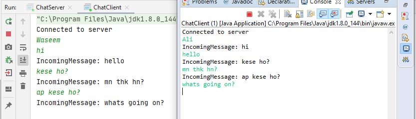
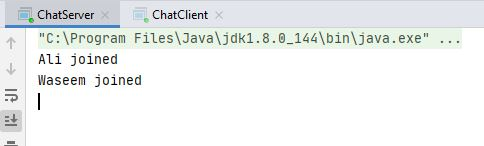

# ChatApp

## ChatApplication using Socket Programming
 

## Introduction
Chat room application.  

    
    

If you have any queries or suggestions you can mail me: f158185@nu.edu.pk

You are welcome to suggest any changes, just send a pull request.

